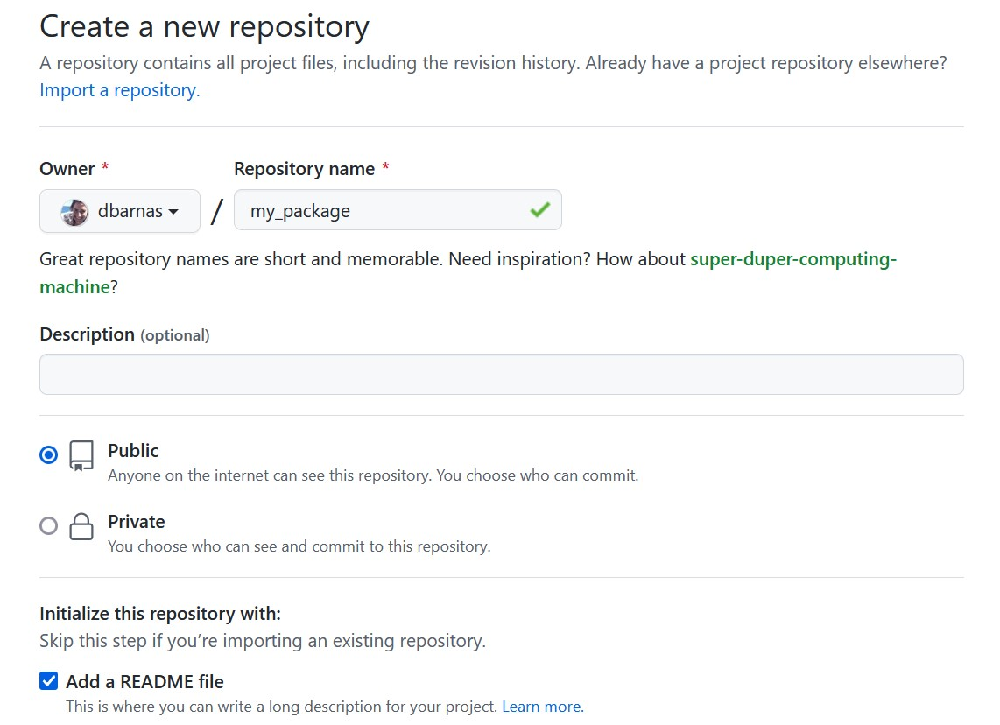

# How to create an R package

## A basic guide to quickly making a package using the roxygen2 package

### 1. Open RStudio and install *devtools* and *roxygen2* packages

In console:  

    install.packages("devtools")  
    install.packages("roxygen2")  

### 2. Create a New Project > New Directory > R Package

### 3. Review the primary components of the package

R folder: location to store functions as scripts (.R files)
    

    
NAMESPACE: file explicitly indicating which functions to export/include in the package (generated and updated by roxygen2)
    

    
DESCRIPTION: metadata about the package, including the package name and description, author information, and any necessary packages that should be installed prior to use and will be loaded simultaneously when this package is loaded.
    

### 4. Create a repository on GitHub with the same package name

Create a new repository for your package on GitHub

Type in the same repository name  
- check for correct capitalization  
- do *not* initialize the repository with a README file, .gitignore, or license

### 5. Put your new project on GitHub for version control

In RStudio: Tools > Version Control > Project Setup

Choose **git** as the version control system

Restart RStudio when prompted

Open your Terminal in RStudio

Type the following line by line in your Terminal

    git init
    git add *
    git commit -m "first commit"
    git branch -M main
    git remote add origin git@github.com:USERNAME/PackageName.git
    git push -u origin main

### 6. Write your first function

Open a new .R file

- example of how we will format our script

## Resources

- Creating an R package with roxygen2: https://vandomed.github.io/build_rpackage.html  
- Putting your R package on github: https://kbroman.org/pkg_primer/pages/github.html  

