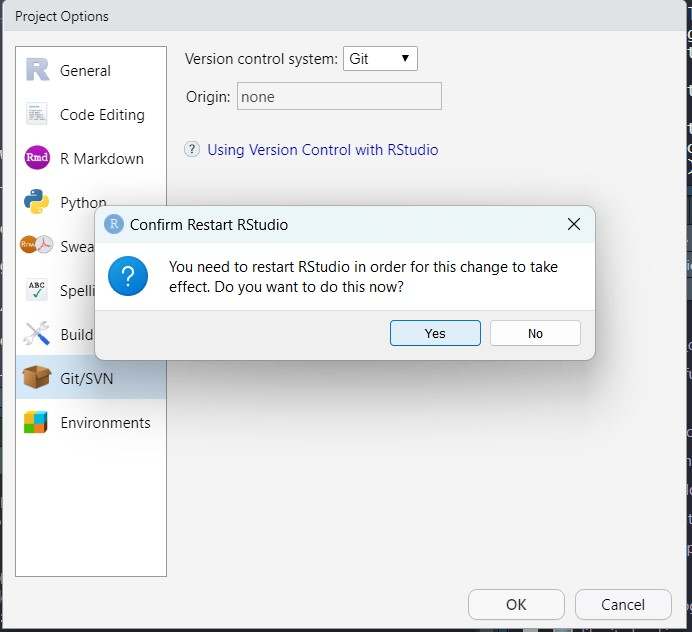
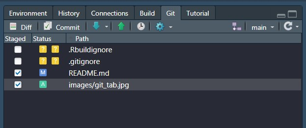

# How to create an R package

*Author: Danielle Barnas*  
*Created February 25, 2023*  

## A basic guide to quickly making a package using the roxygen2 package in RStudio

## Why are packages useful?

**1. Keep common functions for similar use together**

**2. Functions avoid reinventing the wheel and repititious coding throughout your scripts**

**3. Declutter your scripts by turning many lines of code into simple single lines of code**

**4. Pushing to GitHub allows collaborative input to make your functions better/more useful/more generlized (when helpful)**

**5. CRAN packages (peer-reviewed) can fill a need in the R community, benefitting more than just your own code**

## Let's build!

### 1. Open RStudio and install *devtools* and *roxygen2* packages

In console:  

    install.packages("devtools")  
    install.packages("roxygen2")  

### 2. Create a New Project > New Directory > R Package

### 3. Review the primary components of the package

R folder: location to store functions as scripts (.R files)
    

    
NAMESPACE: file explicitly indicating which functions to export/include in the package (generated and updated by roxygen2)
    

    
DESCRIPTION: metadata about the package, including the package name and description, author information, and any necessary packages that should be installed prior to use and will be loaded simultaneously when this package is loaded.
    

(We can delete the current R script "hello" and also the NAMESPACE for now. NAMESPACE will be generated again when we build our package later)

### 4. Create a repository on GitHub with the same package name

Create a new repository for your package on GitHub

Type in the same repository name  
- check for correct capitalization  
- do *not* initialize the repository with a README file, .gitignore, or license

GitHub will give instructions on how to initialize a new repository in your Terminal (we'll come back to this in just a moment)

### 5. Put your new project on GitHub for version control

In RStudio: Tools > Version Control > Project Setup

Choose **git** as the version control system

Restart RStudio when prompted

Open your Terminal in RStudio

Type the following line by line in your Terminal

    git init
    git add *
    git commit -m "first commit"
    git branch -M main
    git remote add origin https://github.com/dbarnas/myPackage.git
    git push -u origin main

### 6. Write your first function

Open a new .R file

- example of how we will format our script

    #' my_function
    #'
    #' This function will add two parameters together and return the sum
    #'
    #' @param parameter_one Numerical value added to parameter_two
    #' @param parameter_two Numerical value added to param_one
    #' return Sum of two parameters will be returned
    #' @export
    my_function <- function(parameter_one, parameter_two){
    
    my_sum <- parameter_one + parameter_two
    
    return(my_sum)
    }

### 7. Save your script (same name as your function)

### 8. Build your package

    devtools::document()

Check that NAMESPACE has been generated and updated with your function

### 9. Push package updates to GitHub through Terminal or Git tab

Terminal:

    git add *
    git commit -m "create first function"
    git push

Git Tab:

- Click on the Git Tab

- Click the boxes of any files you want to update. Boxes should show a check mark once selected

- Select Commit - a new window will pop up

- Type your message then click Commit. Click Push (or green up arrow) to send your files to GitHub.

### 10. install and load your package (in the Console)

    devtools::install_github("dbarnas/myPackage")  
    library(myPackage)  

roxygen2 syntax yields useful function documentation

    ?my_function

### 11. Revel in your success!!!

## Resources

- Creating an R package with roxygen2: https://vandomed.github.io/build_rpackage.html  
- Putting your R package on github: https://kbroman.org/pkg_primer/pages/github.html  

